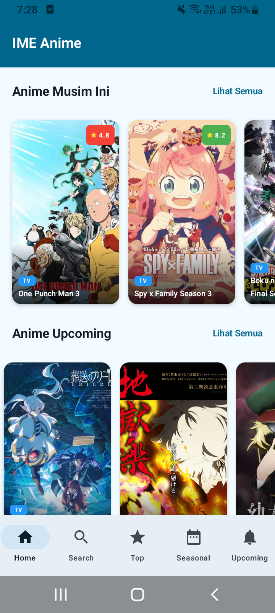

# 📱 Aplikasi Informasi Anime — Jikan API

Aplikasi ini menampilkan beragam informasi anime menggunakan **Jikan API v4**  
(https://api.jikan.moe/v4/).  
Dibangun dengan **Jetpack Compose**, aplikasi ini dirancang dengan tampilan modern, responsif, dan mudah digunakan.

---

## ✨ Fitur Utama
- Menampilkan **Top Anime**
- Menampilkan **Anime Berdasarkan Musim Sekarang**
- Menampilkan **Anime yang akan datang**
- **Pencarian** Anime
- Detail Anime lengkap (judul, sinopsis, skor, studio, trailer, dll.)

---

## 🛠 Teknologi yang Digunakan
- **Kotlin**
- **Jetpack Compose**
- **Android ViewModel**
- **Retrofit** (konsumsi API)
- **Coil** (load gambar)
- **Coroutines + Flow**
- **Material 3 Design**

---

### 📸 Screenshot Aplikasi

| No. | Tampilan                      | Gambar |
| --- | ----------------------------- | ------- |
| 1   | Home – Top 10 Anime           |  |
| 2   | Home – Seasonal Anime         |  |
| 3   | Home – This Season's Anime    |  |
| 4   | Home – Upcoming Anime         |  |
| 5   | Menu – Home                   |  |
| 6   | Menu – Search Anime           |  |
| 7   | Menu – Seasonal Anime         |  |
| 8   | Menu – Top Anime              |  |
| 9   | Menu – Upcoming Anime         |  |