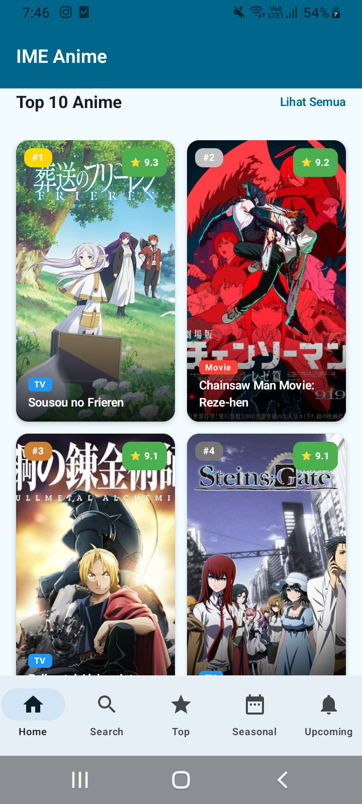
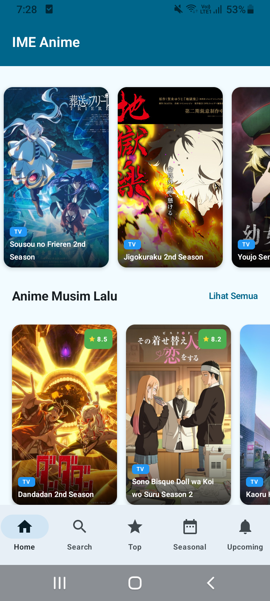
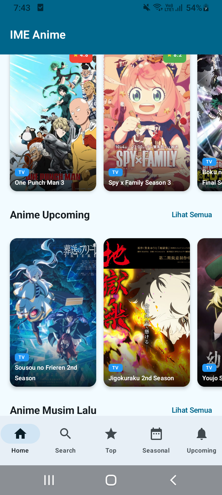
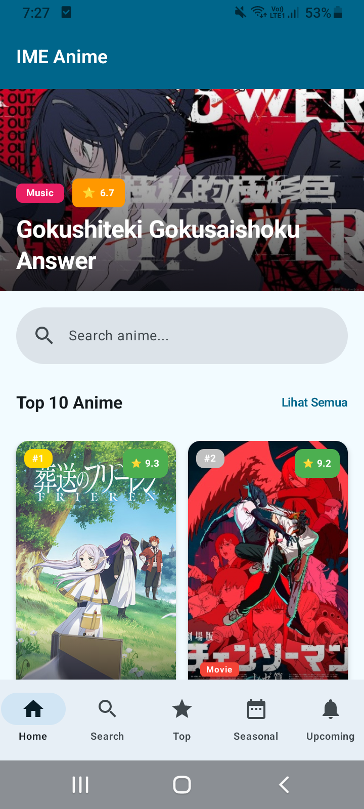
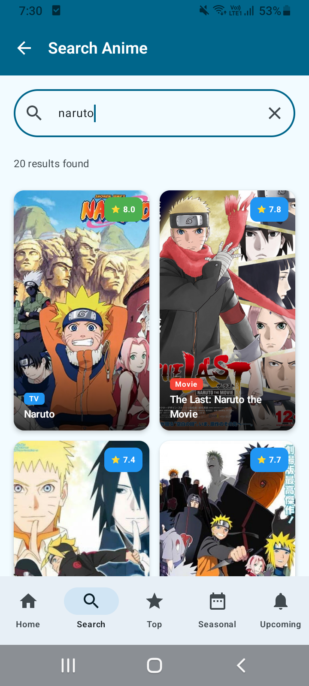
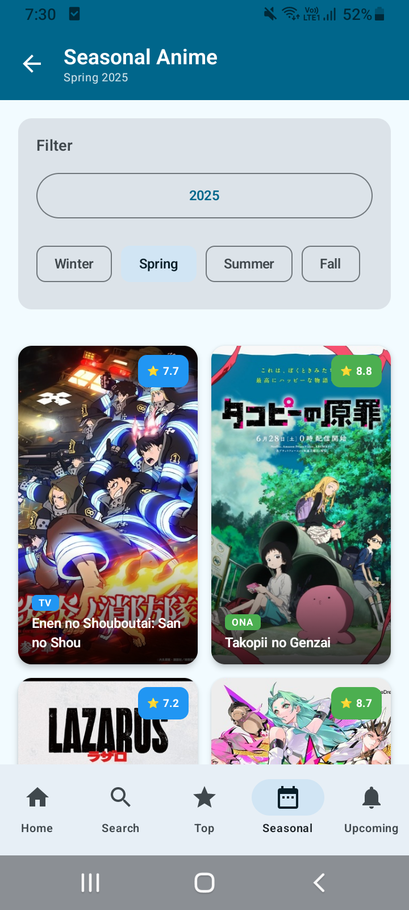
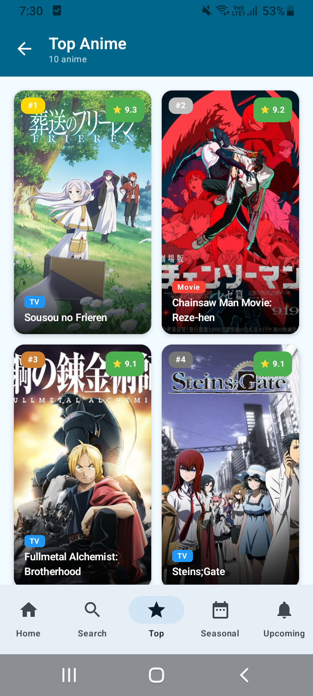
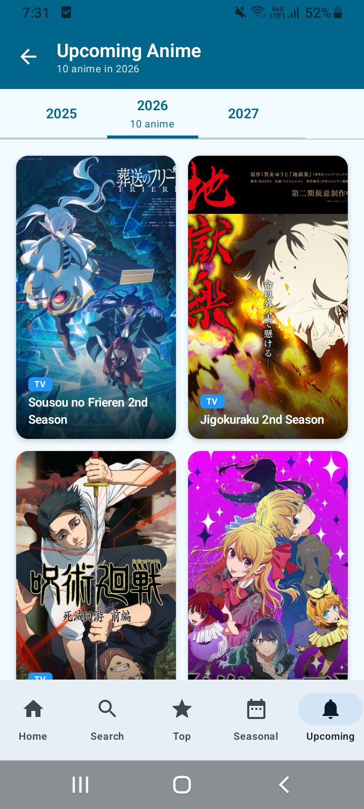

# 📱 Aplikasi Informasi Anime — Jikan API

Aplikasi ini menampilkan beragam informasi anime menggunakan **Jikan API v4**  
(https://api.jikan.moe/v4/).  
Dibangun dengan **Jetpack Compose**, aplikasi ini dirancang dengan tampilan modern, responsif, dan mudah digunakan.

---

## ✨ Fitur Utama
- Menampilkan **Top Anime**
- Menampilkan **Anime Berdasarkan Musim Sekarang**
- Menampilkan **Anime yang akan datang**
- **Pencarian** Anime
- Detail Anime lengkap (judul, sinopsis, skor, studio, trailer, dll.)

---

## 🛠 Teknologi yang Digunakan
- **Kotlin**
- **Jetpack Compose**
- **Android ViewModel**
- **Retrofit** (konsumsi API)
- **Coil** (load gambar)
- **Coroutines + Flow**
- **Material 3 Design**

---

### 📸 Screenshot Aplikasi

| No. | Tampilan                    | Gambar |
| --- | --------------------------- | ------ |
| 1   | Home – Top 10 Anime         |  |
| 2   | Home – Seasonal Anime       |  |
| 3   | Home – This Season's Anime  |  |
| 4   | Home – Upcoming Anime       |  |
| 5   | Menu – Home                 |  |
| 6   | Menu – Search Anime         |  |
| 7   | Menu – Seasonal Anime       |  |
| 8   | Menu – Top Anime            |  |
| 9   | Menu – Upcoming Anime       |  |

<!-- @import "[TOC]" {cmd="toc" depthFrom=1 depthTo=6 orderedList=false} -->

<!-- code_chunk_output -->

- [📱 Aplikasi Informasi Anime — Jikan API](#-aplikasi-informasi-anime--jikan-api)
  - [✨ Fitur Utama](#-fitur-utama)
  - [🛠 Teknologi yang Digunakan](#-teknologi-yang-digunakan)
    - [📸 Screenshot Aplikasi](#-screenshot-aplikasi)

<!-- /code_chunk_output -->

